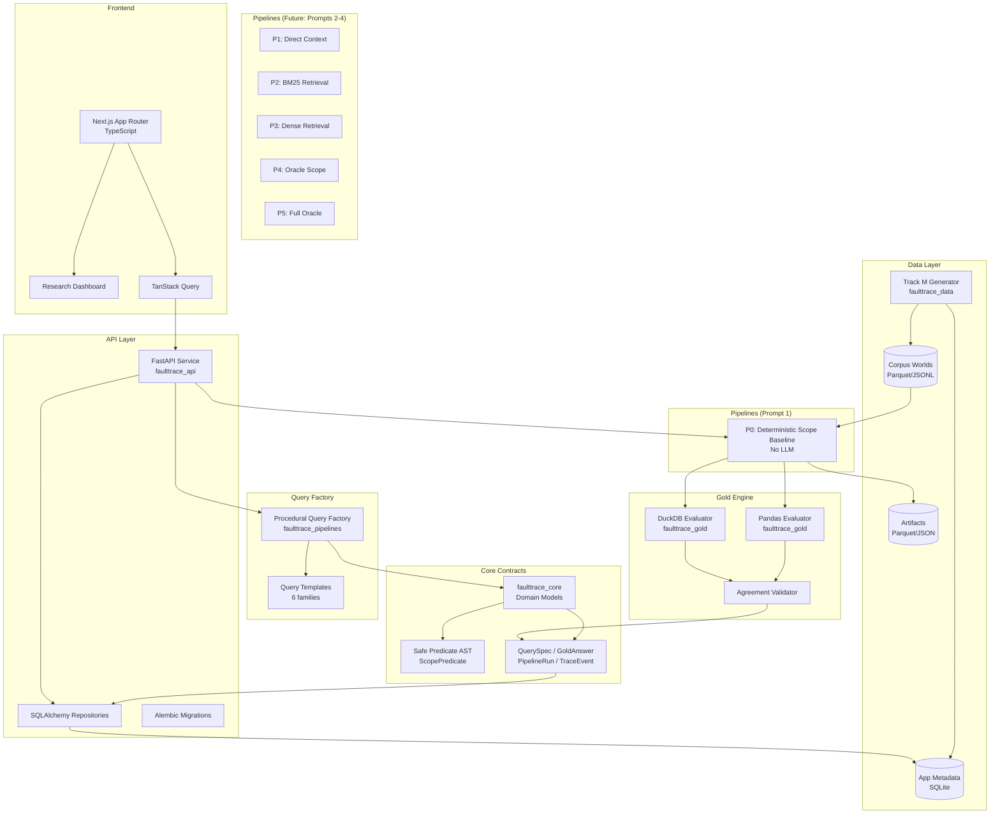

# Architecture: FaultTrace-RAG

## Overview

FaultTrace-RAG is a research system for counterfactual fault localization in LLM analytics pipelines. It benchmarks six pipeline configurations (P0-P5), executes deterministic oracle replacements, and computes recoverable-error attribution across three error sources: Retrieval (R), Extraction (E), and Aggregation (A).

---

## Component Diagram



---

## Data Flow

### Seeding Flow
```
faulttrace data seed --seed 42 --scales 10,50,200,1000
  -> TrackMGenerator(seed=42)
     -> World(N=10)  -> Parquet + JSONL + manifest
     -> World(N=50)  -> Parquet + JSONL + manifest (superset of N=10)
     -> World(N=200) -> Parquet + JSONL + manifest (superset of N=50)
     -> World(N=1000)-> Parquet + JSONL + manifest (superset of N=200)
  -> Register worlds in SQLite metadata DB
```

### Query Generation Flow
```
faulttrace query generate --world-id <id>
  -> QueryFactory.generate(world, families=[...], count=60)
     -> For each template x parameterization:
        -> Instantiate QuerySpec with ScopePredicate + AggregationSpec
        -> Validate: non-empty scope, valid predicate, supported aggregation
        -> Compute GoldAnswer via PandasEvaluator + DuckDBEvaluator
        -> Assert agreement; persist query + gold
```

### Pipeline Run Flow
```
POST /api/v1/runs {query_id, pipeline_id}
  -> PipelineRunner.execute(query_spec, corpus_world)
     -> Stage 1: Load query     -> TraceEvent(stage=query_load)
     -> Stage 2: Scope          -> TraceEvent(stage=scope_enumerate)
     -> Stage 3: Extract        -> TraceEvent(stage=fact_extract)
     -> Stage 4: Aggregate      -> TraceEvent(stage=aggregate)
     -> Stage 5: Validate       -> TraceEvent(stage=validate)
     -> Stage 6: Persist        -> TraceEvent(stage=persist)
  -> PipelineRun saved to SQLite
  -> Artifacts saved to artifacts/runs/<run_id>/
```

---

## Storage Layout

```
data/
  generated/
    worlds/
      world_<id>/
        records.parquet          # columnar record storage
        records.jsonl            # streaming format
        manifest.json            # generator metadata + hashes
  fixtures/
    adversarial_*.jsonl          # controlled edge cases

artifacts/
  runs/
    <run_id>/
      config.json                # immutable run configuration hash
      trace.jsonl                # all TraceEvents
      scope_output.parquet       # records in scope
      extraction.parquet         # extracted fact rows
      aggregation_result.json    # aggregation plan + result
      gold_answer.json           # gold comparison

  queries/
    queries_<world_id>.jsonl     # generated query library

  smoke/
    smoke_report_<timestamp>.json

<app_data>/
  faulttrace.db                  # SQLite: worlds, queries, runs, traces
  alembic.ini                    # migration config
```

---

## Trust Boundaries

1. **Predicate Safety**: `ScopePredicate` is a closed AST. `eval()` is never called on user or corpus text.
2. **Query Validation**: All QuerySpecs are validated before gold computation.
3. **Artifact Hashing**: Every artifact references a content hash; hashes are stored immutably with runs.
4. **No External Calls**: Default execution requires no network access, no GPU, no paid APIs.
5. **No Public Exposure**: CORS is configured from environment; no auto-deploy.

---

## Extension Points

| Extension | Mechanism |
|-----------|-----------|
| New pipeline (P1-P5) | Implement `AbstractPipeline` in `faulttrace_pipelines` |
| New LLM provider | Implement `ModelProvider` interface; register in provider registry |
| New aggregation type | Add to `AggregationSpec.kind` enum; implement in both gold engines |
| New corpus dataset | Implement `AbstractGenerator`; register manifest schema |
| New query family | Add `QueryTemplate` subclass; register in `QueryFactory` |
| PostgreSQL persistence | Set `DATABASE_URL` to postgres:// in `.env`; run migrations |
| Dense retrieval | Add retrieval stage to pipeline; implement `RetrieverInterface` |
